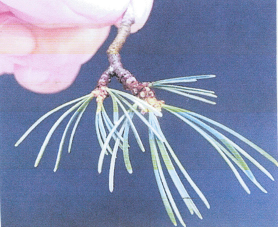

小出朝男さんからご提供いただいた五葉松の多芽法の資料を公開します。

Twitterでいつも交流させていただいている、[小出朝男](https://twitter.com/Koide_Bonsai)さんが、五葉松の管理方法「多芽法」を考案されて資料にまとめてらっしゃるということで、それを１部いただきました。

詳細は下記のPDFをご覧いただければと思いますが、なかなか芽が吹きにくく、枝作りが難しいと言われる五葉松の、画期的な管理方法となるかもしれません。

<blockquote class="twitter-tweet">
皆さんの配送提案、参考にさせて頂きます。「多芽法」どの様なるかを説明不足で御免なさい。私の方法で作った五葉は、1の写真です。2は枝の写真です。 ３~4の写真は今年購入した品に多芽法を一回行った状態です。作業は7/1～１週間の内で行い、４回位で枝が混んできます。簡単ですがこんな作業です。 <a href="https://t.co/fufLS2C8Lm">pic.twitter.com/fufLS2C8Lm</a>
&mdash; 小出　朝男 (@Koide_Bonsai) <a href="https://twitter.com/Koide_Bonsai/status/1173798137837678594?ref_src=twsrc%5Etfw">September 17, 2019</a></blockquote>

[資料ダウンロード](./tamehou.pdf)

今では定番となった黒松の芽切りよろしく、五葉松の多芽法も当たり前となるかもしれません。是非、多くの方に試していただいて、その結果を共有できればと思います。

私も早速来季から試してみたいと思います。

小出さん、資料のご提供どうもありがとうございました。

