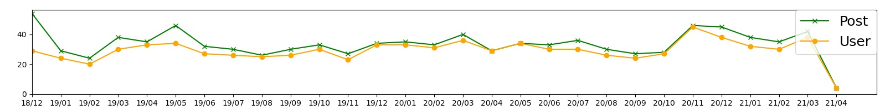
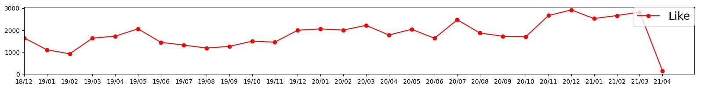
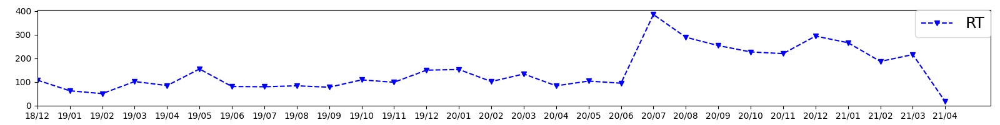
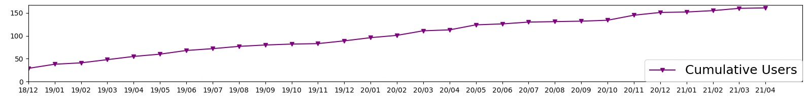

## なぜ今データ分析？

第２９回ツイ盆展が開催されている真っ最中ではありますが、これまで２年と少しやってきまして、参加していただいている皆さんのおかげで色々とデータも溜まってきました。
前々からこのデータを分析してみて、一度投稿数とかの傾向を見てみたいなぁと思ってはいたんです。2020年7月にはリツイート式による表彰という新しいルールを導入しましたし、そういった影響がどう現れているんだろうと。ですが、重い腰が上がらずにずるずるときて、はや２９回目を迎えるに至ったという感じです。

あと、もう１つの理由として、ツイ盆展で使っているプログラムの作成がそこそこ出来てきて、色々な処理を行えるようになってきた、というのも大きい理由です。

ただ、まだ手動でやっている部分も多く、例えば今回の分析で使っているデータですが、毎月のデータの集計のタイミングが違っていたりするので、その辺りはあくまで参考程度ということで。

ということで、早速分析していきたいと思います。

## 総投稿数/ユニーク投稿者数

2018年12月から始まって、現在開催中の2021年4月までの各回の投稿作品の総数(緑色)、及びユニーク投稿者数(黄色)の推移になります。

初回は物珍しさが受けたのか投稿数も多かったですね。ただユニーク投稿者数で言うとそこまで多くもないので、複数の作品を投稿していた方が多かったということでしょう。

その後は増えたり減ったりを繰り返して、2020年の11月にピークを迎えています。
2020年の11月に一体何が起こったのか、全く思い当たる節はありませんｗ

ツイ盆展の特徴の一つとして、隔月で設定しているテーマがあります。
このテーマの有無によって投稿数がどうなるのか、というのも興味深いところだったんですが、そこまで隔月で変化が起きているようにも見えません。かといって、毎年の季節的な変化があるようにも見えません。よくわかりません。

2020年の初頭から全国各地を襲った新型コロナウィルスに関してはどうでしょうか。
2020年の4月,5月,また2021年の1月~3月といった辺りが緊急事態宣言が発令されていた時期ですが、そこまで直接的な変化は見られません。ただ、ジワジワとこういった社会情勢が盆栽人口を押し上げて、2020年11月辺りの増加トレンド担っているという可能性もあるかもしれません。

## 総Like数

各回の投稿作品に対する、Like(Fav)の合計数の推移になります。

基本的には、投稿数の推移とほぼ連動しているように見えます。
ただ、投稿数よりは、右肩あがりの基調が見えるような気がします。これは運営者の贔屓目ではなく、そこそこ顕著な傾向ではないでしょうか。

## 総リツイート数

面白いのはこれですね、総リツイート数です。

[こちらの記事](/blog/2020-07-17--retweet)でアナウンスしましたが、2020年7月の第20回ツイ盆展を迎える時に、新たに導入したのがこのリツイート制度です。
それまで、運営メンバーの独断と偏見で受賞作品を決めていましたが、やはり運営メンバーの好みで選ばれてしまい、かといって選考の基準がどこかに明文化されているわけではない、という状況でした。
より多くの人に参加してもらうためには、表彰ひとつとっても明確な基準があったほうが良いだろう、またその過程に多くの人に参加してもらえたら、よりツイ盆展に親しみを持ってもらえるだろいう、ということでリツイート数のみで表彰作品を決定するようにしました。

その結果として、2020年7月のリツイート数は跳ね上がっています。その後は少し減少していますが、それでもリツイート制導入までに比べると２~３倍程度の水準は保っているようです。

## 累積投稿者数

さて、最後は運営側としてはとても気になる数値。累積投稿者数です。
これはつまり、過去に一度でもツイ盆展に投稿したことがある人の人数です。

なぜこれが運営側として気になるかというと、これが仮に頭打ちしているようだと、ツイ盆展の出展作品数の増加が見込めなくなるからです。Twitter上には、いや日本にはツイ盆展に参加してくれそうな人はもう既に参加している、そんな状況だと今後の発展は非常に難しくなりますから。

そんなわけでこのグラフを恐る恐る見てみると、幸いなことに頭打ちしているということは無さそうです。
またどこかのタイミングで、急に増えるわけでもなく、ジワジワと増えていっている、そんな感じです。
まぁテレビなどで紹介されれば急増することもあるかもしれないですが、ほとんど宣伝活動はしていない状況ですので、
まぁ当然の結果でしょうね。

ただ、累積投稿者数が単調増加しているのに、各回の投稿作品数がそこまで増えていないのはどういうことでしょう？
その原因を想像するに、何度か投稿してみたけど、その後は投稿していない人が多い、ということではないでしょうか。
運営メンバーは強制的にツイ盆展開催初日に作品を投稿することになっていますのでよくわかりますが、やはり毎月盆栽
の作品を投稿するのは、よっぽど慣れている人や多くの飾れる樹などを持っている人ではないかぎり、かなり大変です。
盆栽を始めたばかりの人は所有している盆栽の数も多くないでしょうし、また飾りに使う道具なども潤沢でないでしょう
から、毎月投稿できるようなネタがない、ということになるのも頷けます。

ただ、ツイ盆展はこれからも運営メンバーの精根尽き果てるまでは、ここで毎月開催していますので、是非気が向いた
タイミングでまた投稿してもらえればいいなと思っています。

## まとめ

さて、そんな感じで最後は分析じゃなくてお願いになってしまいましたが、
このだらだらとした文章を一応まとめておきましょう。

- 作品数は横ばいだけど、総Like数は増加傾向、つまり注目度は上がっているゾ！
- リツイート制は楽しんでもらえている？きっとたぶん。
- コロナの影響でもっとみんな盆栽初めてもいいんだよ。
- 毎月投稿するのは大変。でも気が向いた時にはいつでもここで待ってます（ニッコリ

さて、また気が向いた時に、そしてさらなるデータが溜まった時にまたこの分析をやってみたいと思います。
最後まで読んでいただいてありがとうございました。

