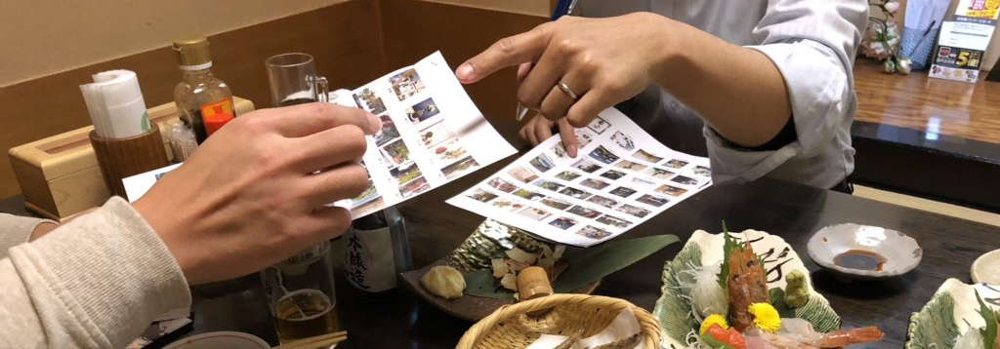

２０１８年１２月８日から１２月１６日まで開催されました、第１回ツイ盆展への多数のご出展どうもありがとうございました。

出展された席数は、

## 60席

そして、それらの出展作品へのTwitter上でのいいねの総数は

## 1993いいね！

でした。

作品の優劣は各人の感じ方次第ですので、表彰は順位づけは止めようという意見もありましたが、ツイ盆展の盛り上がりのためのちょっとしたお楽しみということで、運営メンバーの独断と偏見で受賞作品を選定させていただきました。

なお、これが選定の模様です(笑)

以下、受賞作品の発表です。(なお、全作品は[こちら](/twibonten-1-photo/))

---

## 正統派賞

盆栽と柴犬小梅さんの作品

<blockquote class="twitter-tweet" data-lang="ja">
ツイ盆展の幹事様、ご苦労様です  少しでも盆栽の気軽さ、楽しさ、を感じて貰えるように、私も参加させて頂きます。<a href="https://twitter.com/hashtag/%E3%83%84%E3%82%A4%E7%9B%86%E5%B1%95?src=hash&amp;ref_src=twsrc%5Etfw">#ツイ盆展</a> <a href="https://t.co/jvDWUfDN9C">pic.twitter.com/jvDWUfDN9C</a>
&mdash; 盆栽と柴犬小梅 (@dIy1nTBZsWYElAN) <a href="https://twitter.com/dIy1nTBZsWYElAN/status/1072833033412038656?ref_src=twsrc%5Etfw">2018年12月12日</a></blockquote>

---

## フォトジェニック賞
浦和のけんじい盆栽小鉢さんの作品

<blockquote class="twitter-tweet" data-lang="ja">
ツイ盆展を始められた幹事？の皆さんお仕事の傍ら取り組まれておりお疲れ様です。盆栽普及に頑張りましょう～ この時期、所有樹の中から選ぶのに苦労しましたぁ。ハッシュタグ付けるの初めてですが、これで良かったですか。何せ、年寄りなものですから。<a href="https://twitter.com/hashtag/%E3%83%84%E3%82%A4%E7%9B%86%E5%B1%95?src=hash&amp;ref_src=twsrc%5Etfw">#ツイ盆展</a> <a href="https://t.co/CxAYZiUt2B">pic.twitter.com/CxAYZiUt2B</a>
&mdash; 浦和のけんじい盆栽小鉢 (@kennji449) <a href="https://twitter.com/kennji449/status/1072719639434543105?ref_src=twsrc%5Etfw">2018年12月12日</a></blockquote>

---

## アイデア賞
モノノフの釣人さんの作品

<blockquote class="twitter-tweet" data-lang="ja">
過去画像ですが、こんな感じでミニ盆栽楽しんでます。 自作超ミニ鉢に、超ミニ盆栽各種<a href="https://twitter.com/hashtag/%E3%83%84%E3%82%A4%E7%9B%86%E5%B1%95?src=hash&amp;ref_src=twsrc%5Etfw">#ツイ盆展</a> <a href="https://t.co/CFKK7RkGuB">pic.twitter.com/CFKK7RkGuB</a>
&mdash; モノノフの釣人 (@turinchu1987) <a href="https://twitter.com/turinchu1987/status/1071674975738748928?ref_src=twsrc%5Etfw">2018年12月9日</a></blockquote>

---

## アイデア賞

BonitoBonsai大好き！さんの作品

<blockquote class="twitter-tweet" data-lang="ja">
うちの段飾りです。<a href="https://twitter.com/hashtag/%E3%83%84%E3%82%A4%E7%9B%86%E5%B1%95?src=hash&amp;ref_src=twsrc%5Etfw">#ツイ盆展</a> <a href="https://t.co/zLht2E5ShS">pic.twitter.com/zLht2E5ShS</a>
&mdash; BonitoBonsai大好き！ (@P205GTI1904) <a href="https://twitter.com/P205GTI1904/status/1071783617729245184?ref_src=twsrc%5Etfw">2018年12月9日</a></blockquote>

---

## オシャレ賞
ヨシナガさんの作品

<blockquote class="twitter-tweet" data-lang="ja">
今晩😁ツイ盆展すばらしいですね 気軽に展示する場が出来うれしいです👌 お三方とも頑張って下さい それにしても他の方々の盆栽及び写真いいものばかり😅<a href="https://twitter.com/hashtag/%E3%83%84%E3%82%A4%E7%9B%86%E5%B1%95?src=hash&amp;ref_src=twsrc%5Etfw">#ツイ盆展</a>  画像１ 全体  画像2コナラ  樹高4㎝ 幅6㎝ 鉢3㎝  画像3檜と猫  檜  樹高9㎝ 幅9㎝ 鉢5㎝  画像4イチイと茅舎 イチイ上下5㎝ 鉢3㎝ <a href="https://t.co/NdyZXR4YAH">pic.twitter.com/NdyZXR4YAH</a>
&mdash; ヨシナガ (@OcC1lhe8Ko0hzOw) <a href="https://twitter.com/OcC1lhe8Ko0hzOw/status/1071415623073202176?ref_src=twsrc%5Etfw">2018年12月8日</a></blockquote>

---

## 新人賞
金澤/てしごと屋盆栽村店さんの作品

<blockquote class="twitter-tweet" data-lang="ja">
思い切って、つまみ細工と一緒に飾ってみました。  スイレンボクです（盆栽と言えるものがこれしかない！） つまみ細工は梅づくしで。   <a href="https://twitter.com/hashtag/%E3%83%84%E3%82%A4%E7%9B%86%E5%B1%95?src=hash&amp;ref_src=twsrc%5Etfw">#ツイ盆展</a><a href="https://twitter.com/hashtag/%E3%81%A4%E3%81%BE%E3%81%BF%E7%B4%B0%E5%B7%A5?src=hash&amp;ref_src=twsrc%5Etfw">#つまみ細工</a> <a href="https://twitter.com/hashtag/%E9%9A%8E%E6%AE%B5%E7%AE%AA%E7%AC%A5?src=hash&amp;ref_src=twsrc%5Etfw">#階段箪笥</a> <a href="https://t.co/lPOjt6DgBu">pic.twitter.com/lPOjt6DgBu</a>
&mdash; 金澤/てしごと屋盆栽村店 (@kami_kazari) <a href="https://twitter.com/kami_kazari/status/1071612660465057792?ref_src=twsrc%5Etfw">2018年12月9日</a></blockquote>

---

## いいね賞
BONSAI 30sさんの作品

<blockquote class="twitter-tweet" data-lang="ja">
【正月寄せ植え】 ・紅梅、白梅、黒松、笹、南天、寒菊、ヤブコウジの寄せ植え🌳  毎年この時期になると正月寄せ植えを楽しんでいます。 盆栽としては一発物ですが、今年は中央に流れる小川と倒れるように川辺に生える紅白の梅を風景にしてみました😁🏞 元旦に満開を狙って管理中です。<a href="https://twitter.com/hashtag/%E3%83%84%E3%82%A4%E7%9B%86%E5%B1%95?src=hash&amp;ref_src=twsrc%5Etfw">#ツイ盆展</a> <a href="https://t.co/J7ZaDoaIwL">pic.twitter.com/J7ZaDoaIwL</a>
&mdash; BONSAI 30s (@VCERI6OkiQKcqd3) <a href="https://twitter.com/VCERI6OkiQKcqd3/status/1074249279483465728?ref_src=twsrc%5Etfw">2018年12月16日</a></blockquote>

---

&nbsp;

&nbsp;

以下、運営メンバーからの振り返りコメントです。

**fujimax -盆栽HACKS-**
<a href="https://twitter.com/fujimax6" target="_blank">@fujimax6</a>
<a href="https://bonsaihacks.tk" target="_blank">HP</a>

盆栽の輪を広めたい、みんなで交流したい、という思いで始めたツイ盆展でしたが、初回にも関わらずこんなにもたくさんの出展が集まり大変嬉しく思っています。しかし、大事なのはこのツイ盆展という交流の場をこれからも維持していくこと。引き続きみなさまのご協力どうぞよろしくお願いします。

&nbsp;

**百万@盆栽エッセイ漫画連載中**
<a href="https://twitter.com/hyakumanga" target="_blank">@hyakumanga</a>
<a href="http://hyakumanga.com" target="_blank">HP</a>

こんないい企画成功しないわけがないという想いと、ただの愛好家３人の呼びかけにどれだけの人が応えてくれるかという不安がありましたが、第１回から多くの人にご参加いただけて嬉しかったです。しかも期待通りのバラエティー感！
もっとたくさんの人に見ていただけるようこれからも頑張ります。

&nbsp;

**ichiya/falz**
<a href="https://twitter.com/falz_jp" target="_blank">@falz_jp</a>

たくさんの出展ありがとうございました。展示会に並ぶような素晴らしい席飾りや、全く考えつかなかったアイデア展示、はたまた自作の鉢を使った展示など運営の１人でありながら賞も取ることもないのに次回作に向けて意欲が湧く盆栽展でした。皆さま次回も盛り上げて行きましょう！

---

&nbsp;

[次回ツイ盆展](/1st-twibonten-end/)は1月12日から募集開始です。みなさんのご出展お待ちしています。
