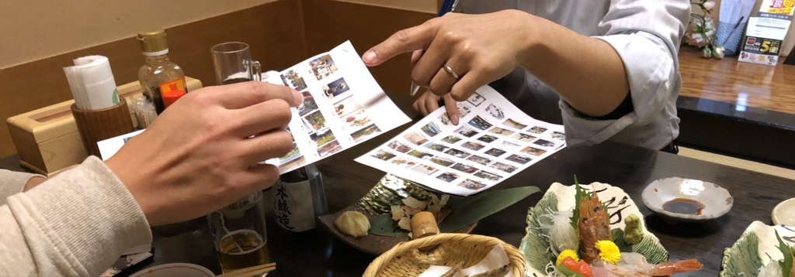

２０１９年１月１２日から２０日まで開催されました、第２回ツイ盆展への多数のご出展どうもありがとうございました。

出展された席数は、

## 37席

そして、それらの出展作品へのTwitter上でのいいねの総数は

## 1369いいね！

でした(2019.1.23時点)。

今回の表彰者選考もご覧の通り難航を極め、杯は進めど選考は進まず...

ふと気づけば空はもう白みはじめ、手元には各賞をまとめた結果とものすごい金額の伝票だけが残っていました。
(すみません、本当は選考は全部ネット上で相談しました)

ということで受賞作品の発表です！
(なお、全作品は[こちら](/twibonten-2-photo/))

---

## 冬景色賞

しおり盆栽さんの作品

<blockquote class="twitter-tweet">
ツイッター上の盆栽展、ツイ盆展に参加します。 テーマは冬。  タイトル「星ぼうき」   <a href="https://twitter.com/hashtag/%E3%83%84%E3%82%A4%E7%9B%86%E5%B1%95?src=hash&amp;ref_src=twsrc%5Etfw">#ツイ盆展</a> <a href="https://t.co/HC6KuOa468">pic.twitter.com/HC6KuOa468</a>
&mdash;しおり盆栽 (@shioribonsai) <a href="https://twitter.com/shioribonsai/status/1083960258584690690?ref_src=twsrc%5Etfw">January 12, 2019</a></blockquote>

東京ミサトオオハシさんの作品

<blockquote class="twitter-tweet">
<a href="https://twitter.com/hashtag/%E3%83%84%E3%82%A4%E7%9B%86%E5%B1%95?src=hash&amp;ref_src=twsrc%5Etfw">#ツイ盆展</a>  鉢と雪だるまは自作の陶小物です。やきもの作家なので、窯用品で構成してみました。後面はつく棒、四角はサイコロ、敷物は小さな棚板です。 (テーマに合わせて鉢も白にすればよかった…と今気付きました笑) <a href="https://t.co/c8ab876pwe">pic.twitter.com/c8ab876pwe</a>
&mdash; 東京ミサトオオハシ (@misatoohashi) <a href="https://twitter.com/misatoohashi/status/1085380958898012160?ref_src=twsrc%5Etfw">January 16,
 2019</a></blockquote>

---

## フォトジェニック賞

盆栽ストーリー さんの作品

<blockquote class="twitter-tweet">
ツイ盆展に出展します。 テーマ『剪定を前に』です。 実生５年、ケヤキです。完全に写真でごまかしてしまいましたが、やはりケヤキはこのシルエットが好きです。<a href="https://twitter.com/hashtag/%E3%83%84%E3%82%A4%E7%9B%86%E5%B1%95?src=hash&amp;ref_src=twsrc%5Etfw">#ツイ盆展</a> <a href="https://t.co/bVRWjQeKMy">pic.twitter.com/bVRWjQeKMy</a>
&mdash; 盆栽ストーリー (@CKrOyzHefhvR6fX) <a href="https://twitter.com/CKrOyzHefhvR6fX/status/1084050660356542464?ref_src=twsrc%5Etfw">January 12, 2019</a></blockquote>

---

## ベストジーニスト賞

ヨシナガ さんの作品

<blockquote class="twitter-tweet">
次に冬の海  写りが悪いので補足 一般的には展示の添えは、他のものがいいとされますが、海をイメージさせて頂いたので松と松を選択 ジーパンを下に敷いてアタリ・ヒゲの部分で小々波を表現してみまし た😄 主木:五葉松   添え:赤松  添配:夫婦蟹  絵: 北斎神奈川沖浪裏<a href="https://twitter.com/hashtag/%E3%83%84%E3%82%A4%E7%9B%86%E5%B1%95?src=hash&amp;ref_src=twsrc%5Etfw">#ツイ盆展</a> <a href="https://t.co/d5oU7MPIiq">pic.twitter.com/d5oU7MPIiq</a>
&mdash; ヨシナガ (@OcC1lhe8Ko0hzOw) <a href="https://twitter.com/OcC1lhe8Ko0hzOw/status/1084300950381064192?ref_src=twsrc%5Etfw">January 13, 2019</a></blockquote>

---

## 収納上手さんで賞

チビポン さんの作品

<blockquote class="twitter-tweet">
昨日から部屋の大掃除をしていました。棚もスッキリ片付いたので飾ってみましたよ☺️<a href="https://twitter.com/hashtag/%E3%83%84%E3%82%A4%E7%9B%86%E5%B1%95?src=hash&amp;ref_src=twsrc%5Etfw">#ツイ盆展</a> <a href="https://t.co/pwi3gGbhPT">pic.twitter.com/pwi3gGbhPT</a>
&mdash; チビポン (@black_pine2) <a href="https://twitter.com/black_pine2/status/1086863468869804032?ref_src=twsrc%5Etfw">January 20, 2019</a></blockquote>

---

## アイデア賞

bonsai太郎 さんの作品

<blockquote class="twitter-tweet">
ツイ盆展の作品がついに完成！  テーマは「池のある盆栽神社」 雪積もる神社での初詣シーンを小さな空間に意識して作りました！ こだわりの池はいろんな器で表現しましたが、これが一番しっくりきました！笑<a href="https://twitter.com/hashtag/%E3%83%84%E3%82%A4%E7%9B%86%E5%B1%95?src=hash&amp;ref_src=twsrc%5Etfw">#ツイ盆展</a><a href="https://twitter.com/hashtag/%E7%9B%86%E6%A0%BD?src=hash&amp;ref_src=twsrc%5Etfw">#盆栽</a><a href="https://twitter.com/hashtag/%E7%A5%9E%E7%A4%BE?src=hash&amp;ref_src=twsrc%5Etfw">#神社</a><a href="https://twitter.com/hashtag/%E5%B0%8F%E3%81%95%E3%81%AA%E5%BA%AD?src=hash&amp;ref_src=twsrc%5Etfw">#小さな庭</a> <a href="https://t.co/zYBESJ7n8k">pic.twitter.com/zYBESJ7n8k</a>
&mdash; bonsai太郎 (@2bqtktLFat83u6i) <a href="https://twitter.com/2bqtktLFat83u6i/status/1086521106834513921?ref_src=twsrc%5Etfw">January 19, 2019</a></blockquote>

---

## いいね賞

BONSAI 30sさんの作品

<blockquote class="twitter-tweet">
【第2回ツイ盆展へ出品させて頂きます。】 左から 黒松、松竹梅寄せ植え、花梨 です。  お題：“冬”について、 寒さに耐える落葉後の花梨と、冬に彩りを添える白梅を選んでみました。 また、よーく見ると冬っぽいアニマルズが隠れています。<a href="https://twitter.com/hashtag/%E3%83%84%E3%82%A4%E7%9B%86%E5%B1%95?src=hash&amp;ref_src=twsrc%5Etfw">#ツイ盆展</a> <a href="https://twitter.com/hashtag/%E7%9B%86%E6%A0%BD?src=hash&amp;ref_src=twsrc%5Etfw">#盆栽</a> <a href="https://twitter.com/hashtag/bonsai?src=hash&amp;ref_src=twsrc%5Etfw">#bonsai</a> <a href="https://twitter.com/hashtag/%E3%82%B7%E3%83%A3%E3%82%AF%E3%83%AC%E3%83%AB%E3%83%97%E3%83%A9%E3%83%8D%E3%83%83%E3%83%88?src=hash&amp;ref_src=twsrc%5Etfw">#シャクレルプラネット</a> <a href="https://t.co/eGCLD6eMyp">pic.twitter.com/eGCLD6eMyp</a>
&mdash; BONSAI 30s (@VCERI6OkiQKcqd3) <a href="https://twitter.com/VCERI6OkiQKcqd3/status/1084201425263980549?ref_src=twsrc%5Etfw">January 12, 2019</a></blockquote>

---

&nbsp;

&nbsp;

以下、振り返りコメントです。

**fujimax -盆栽HACKS-**
<a href="https://twitter.com/fujimax6" target="_blank">@fujimax6</a>
<a href="https://bonsaihacks.tk" target="_blank">HP</a>

今回のツイ盆展は初めてお題を設定させていただきました。
どんな作品が集まるのか、そもそも作品が集まるのかドキドキでしたが、たくさんの力作を投稿していただき、素晴らしいツイ盆展になったと思っています。

考えてみると、席飾りのテーマを自分で決めて飾ることはあっても、他人から設定される機会というのは他ではまず無いんじゃないでしょうか。
みなさんの頭を悩ませてしまったかもしれませんが、盆栽を使って何かを表現するというのもまた１つの盆栽の楽しみ方なんではないでしょうか。
これからもテーマ有り無しを織り交ぜながらやっていきたいと思っていますので、仮に突飛なテーマが設定されても驚くことなく、柔軟なご対応のほどどうぞよろしくお願いします。

また、今回は動画の投稿があったり、盆栽のシルエットを使った作品があったり、運営側の想定を超える作品もいくつかあり、驚きながらも大変楽しませていただきました。
みなさんが感じる盆栽の魅力をそれぞれの表現方法で伝えていただいていて、このツイ盆展という表現と交流の場を企画させていただいたものとしては、まさに企画者冥利につきるという思いです。

これからもより多くの方に参加していただけるよう、色々とアイデアを出していきたいと思っていますので、今後ともどうぞよろしくお願いいたします。

&nbsp;

次回ツイ盆展は2月16日から24日まで開催します。
次回はテーマの設定はありませんので、みなさんの思い思いの飾り方・撮り方での作品を投稿していただければと思います。
たくさんのご出展お待ちしています。

