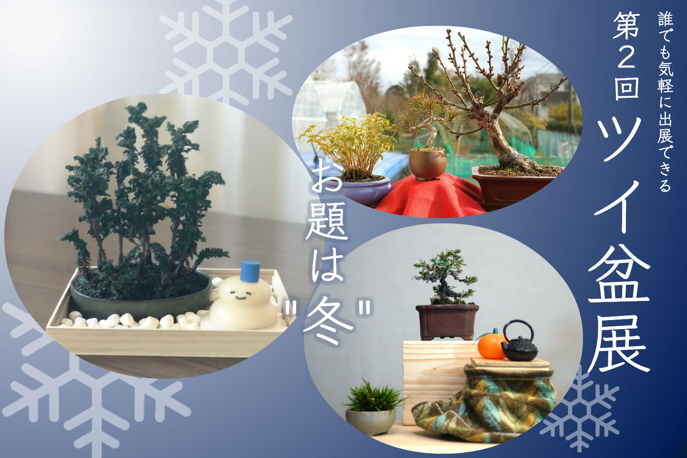

第２回ツイ盆展開催のお知らせです。

先月開催した第１回ツイ盆展に多数のご出展をいただき、是非これからもこの企画を続けていきたいという思いを強くしました。ということで、早速第２回ツイ盆展、募集開始です！

今回は前回とは違って、展示のテーマを設定させていただきました。
今回のテーマはズバリ！「冬」です。 

盆栽は自然の縮図。
盆栽を見ているだけでも自然を感じることができ、心が安らぎで満たされますよね。
そんな身近な自然である盆栽を使い、一手間加えて飾りとして並べてみることで、自然の風景美を表現するというのもまた楽しいものです。

是非、今の季節である「冬」を感じられるような飾りを作ってみんなで盆栽を楽しみませんか？

<h1 align="center" style="color:#709425">#ツイ盆展</h1>

### 募集時期
2019年1月12日(土)〜20日(日)  

上記期間中、ツイ盆展への出展を募集します。
ご応募いただいた作品は、本サイトの展示会のページに掲載されます。
また、ご応募いただいた作品は、本サイトのその他のページでも使用させていただくことがありますので、ご了承ください。

### 投稿方法
募集期間中にTwitterへ写真を添付の上投稿してください。その際ハッシュタグ [#ツイ盆展](https://twitter.com/hashtag/%E3%83%84%E3%82%A4%E7%9B%86%E5%B1%95?f=tweets&src=hash) をお忘れなくつけてください。  
また、写真中の樹種名やお気に入りのポイントなどの一言メッセージを添えていただけると、写真を見た人もより楽しめると思いますのでどうぞよろしくお願いします。

・樹種名 
・お気に入りポイント、飾りの工夫・苦労点など。 
&nbsp;#ツイ盆展&nbsp;

### 投稿写真について
オリジナルの写真、ご自分の盆栽の写真の投稿をお願いします。
それ以外には特にルールはありません。
[よくある質問](/qa)もご参照ください。

### 公式アカウントについて
ツイ盆展<a href="https://twitter.com/twibon_ten" target="_blank">公式アカウント</a>で、各種告知を流しますので、フォローよろしくお願いします。

どちらさまもぜひツイ盆展への出展をお願いします。

※ツイ盆展はTwitter上で開催するオンライン盆栽展です。
盆栽を始めたばかりの初心者さんから、何十年と盆栽を育てているベテランさんまで、間口は広くゆるくがコンセプトです。
ツイ盆展については、[ツイ盆展について](/about)と、[よくある質問](/qa)もご参照ください。

また、ツイ盆展についてのご意見・ご感想など是非お寄せいただければと思います。
Twitterの公式アカウントや、運営メンバーへご連絡いただければ幸いです。

### 投稿イメージ by 運営メンバー

<blockquote class="twitter-tweet" data-partner="tweetdeck">
【第２回ツイ盆展始まりました！】 左からセキショウ、杜松、添配。 冬といえばコタツとミカン、ということで手持ちの台を使ってコタツを作ってみました。<a href="https://twitter.com/hashtag/%E3%83%84%E3%82%A4%E7%9B%86%E5%B1%95?src=hash&amp;ref_src=twsrc%5Etfw">#ツイ盆展</a> <a href="https://twitter.com/hashtag/%E7%9B%86%E6%A0%BD?src=hash&amp;ref_src=twsrc%5Etfw">#盆栽</a> <a href="https://t.co/okMU7CnWNu">https://t.co/okMU7CnWNu</a> <a href="https://t.co/AItz5d4i79">pic.twitter.com/AItz5d4i79</a>
&mdash; fujimax -盆栽HACKS- (@fujimax6) <a href="https://twitter.com/fujimax6/status/1083878559234572288?ref_src=twsrc%5Etfw">January 12, 2019</a></blockquote>

------

<blockquote class="twitter-tweet" data-partner="tweetdeck">
【第２回ツイ盆展は1/20（日）まで！】 石化ヒノキの寄せ植えです。 雪は白い化粧石と見せかけてマシュマロ、雪だるまはお正月に飾った鏡餅にスティクのりの蓋を乗せて。こたつの上で撮りました。  第２回のテーマは「冬」。ぜひツイ盆展（ <a href="https://twitter.com/twibon_ten?ref_src=twsrc%5Etfw">@twibon_ten</a> ）をフォローして下さいね。<a href="https://twitter.com/hashtag/%E3%83%84%E3%82%A4%E7%9B%86%E5%B1%95?src=hash&amp;ref_src=twsrc%5Etfw">#ツイ盆展</a> <a href="https://t.co/MM1K4bXCNI">pic.twitter.com/MM1K4bXCNI</a>
&mdash; 百万@盆栽エッセイ漫画連載中 (@hyakumanga) <a href="https://twitter.com/hyakumanga/status/1083899670122749952?ref_src=twsrc%5Etfw">January 12, 2019</a></blockquote>

------

<blockquote class="twitter-tweet" data-partner="tweetdeck">
【第２回ツイ盆展開催中です！】 「お正月らしい寄せ植えがない！でも松竹梅はある。だったら鉢を寄せたらいいじゃないか。」で作りました。左から金明竹・赤松・紅冬至になります。<a href="https://twitter.com/hashtag/%E3%83%84%E3%82%A4%E7%9B%86%E5%B1%95?src=hash&amp;ref_src=twsrc%5Etfw">#ツイ盆展</a>  <a href="https://twitter.com/hashtag/%E7%9B%86%E6%A0%BD?src=hash&amp;ref_src=twsrc%5Etfw">#盆栽</a> <a href="https://twitter.com/hashtag/bonsai?src=hash&amp;ref_src=twsrc%5Etfw">#bonsai</a> <a href="https://t.co/0AR2pGhfwn">pic.twitter.com/0AR2pGhfwn</a>
&mdash; ichiya/falz (@falz_jp) <a href="https://twitter.com/falz_jp/status/1084018202181398529?ref_src=twsrc%5Etfw">January 12, 2019</a></blockquote>

