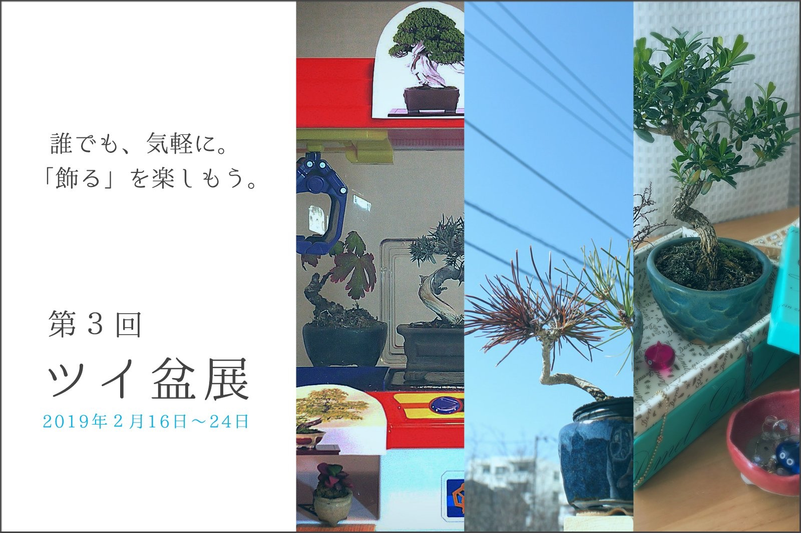

世の中では国風展が開催中で、素晴らしい作品が出展されていますね。
しかし、ツイッター上ではやっぱりツイ盆展！
ということで、今月もツイ盆展盛り上がっていきましょう。

今回でツイ盆展も、はや３回目になります。
先月は投稿テーマを設定させていただきましたが、今回はズバリ！テーマ無し！。
テーマフリーです。

皆さんご自由に盆栽飾りを楽しんでいただければと思います。

<h1 align="center" style="color:#709425">#ツイ盆展</h1>

### 募集時期
2019年2月16日(土)〜24日(日)  

上記期間中、ツイ盆展への出展を募集します。
ご応募いただいた作品は、本サイトの展示会のページに掲載されます。
また、ご応募いただいた作品は、本サイトのその他のページでも使用させていただくことがありますので、ご了承ください。

### 投稿方法
募集期間中にTwitterへ写真を添付の上投稿してください。その際ハッシュタグ [#ツイ盆展](https://twitter.com/hashtag/%E3%83%84%E3%82%A4%E7%9B%86%E5%B1%95?f=tweets&src=hash) をお忘れなくつけてください。  
また、写真中の樹種名やお気に入りのポイントなどの一言メッセージを添えていただけると、写真を見た人もより楽しめると思いますのでどうぞよろしくお願いします。

・樹種名 
・お気に入りポイント、飾りの工夫・苦労点など。 
&nbsp;#ツイ盆展&nbsp;

### 投稿写真について
オリジナルの写真、ご自分の盆栽の写真の投稿をお願いします。
それ以外には特にルールはありません。
[よくある質問](/qa)もご参照ください。

### 公式アカウントについて
ツイ盆展<a href="https://twitter.com/twibon_ten" target="_blank">公式アカウント</a>で、各種告知を流しますので、フォローよろしくお願いします。

どちらさまもぜひツイ盆展への出展をお願いします。

※ツイ盆展はTwitter上で開催するオンライン盆栽展です。
盆栽を始めたばかりの初心者さんから、何十年と盆栽を育てているベテランさんまで、間口は広くゆるくがコンセプトです。
ツイ盆展については、[ツイ盆展について](/about)と、[よくある質問](/qa)もご参照ください。

また、ツイ盆展についてのご意見・ご感想など是非お寄せいただければと思います。
Twitterの公式アカウントや、運営メンバーへご連絡いただければ幸いです。

### 投稿イメージ by 運営メンバー

<blockquote class="twitter-tweet" data-lang="ja">
【第３回ツイ盆展始まりました！】 こんなUFOキャッチャー、あったらやりたい！という夢を形にしてみました(笑) 左からヤブサンザシ、杜松、杜松宝、下から出てるのが桜吹雪（多肉）です。<a href="https://twitter.com/hashtag/%E3%83%84%E3%82%A4%E7%9B%86%E5%B1%95?src=hash&amp;ref_src=twsrc%5Etfw">#ツイ盆展</a> <a href="https://twitter.com/hashtag/%E7%9B%86%E6%A0%BD?src=hash&amp;ref_src=twsrc%5Etfw">#盆栽</a> <a href="https://twitter.com/hashtag/bonsai?src=hash&amp;ref_src=twsrc%5Etfw">#bonsai</a> <a href="https://t.co/0GU36bf6Lk">pic.twitter.com/0GU36bf6Lk</a>
&mdash; fujimax -盆栽HACKS- (@fujimax6) <a href="https://twitter.com/fujimax6/status/1096564943518785536?ref_src=twsrc%5Etfw">2019年2月16日</a></blockquote>

------

<blockquote class="twitter-tweet" data-lang="ja">
昨年の秋雅展で女性盆栽家のちえさん（ <a href="https://twitter.com/bonsai_chie?ref_src=twsrc%5Etfw">@bonsai_chie</a> ）から購入した台湾ツゲと八房ケヤキです。  盆栽はかわいい、ということを表現したくて撮った１枚。 キラキラした物を詰め込んだ宝箱のイメージだったけど、そもそもキラキラした物なんてそんなに持ってなかったわ！あはは！！  <a href="https://twitter.com/hashtag/%E3%83%84%E3%82%A4%E7%9B%86%E5%B1%95?src=hash&amp;ref_src=twsrc%5Etfw">#ツイ盆展</a> <a href="https://twitter.com/hashtag/%E7%9B%86%E6%A0%BD?src=hash&amp;ref_src=twsrc%5Etfw">#盆栽</a> <a href="https://t.co/S8BWOk9yNF">pic.twitter.com/S8BWOk9yNF</a>
&mdash; 百万@盆栽漫画連載中 (@hyakumanga) <a href="https://twitter.com/hyakumanga/status/1096565449754501120?ref_src=twsrc%5Etfw">2019年2月16日</a></blockquote>

------

<blockquote class="twitter-tweet" data-partner="tweetdeck">
冬の空、紅葉した赤松。本当は単に赤松を縦に並べて奥行きを出すつもりが、いつの間にか空がメインに...でも何かキレイな仕上がりになったのでこれでいく！<a href="https://twitter.com/hashtag/%E3%83%84%E3%82%A4%E7%9B%86%E5%B1%95?src=hash&amp;ref_src=twsrc%5Etfw">#ツイ盆展</a> <a href="https://twitter.com/hashtag/%E7%9B%86%E6%A0%BD?src=hash&amp;ref_src=twsrc%5Etfw">#盆栽</a> <a href="https://twitter.com/hashtag/bonsai?src=hash&amp;ref_src=twsrc%5Etfw">#bonsai</a> <a href="https://t.co/Ho2N5d2SBu">pic.twitter.com/Ho2N5d2SBu</a>
&mdash; ichiya/falz (@falz_jp) <a href="https://twitter.com/falz_jp/status/1096561859887431681?ref_src=twsrc%5Etfw">February 16, 2019</a></blockquote>

